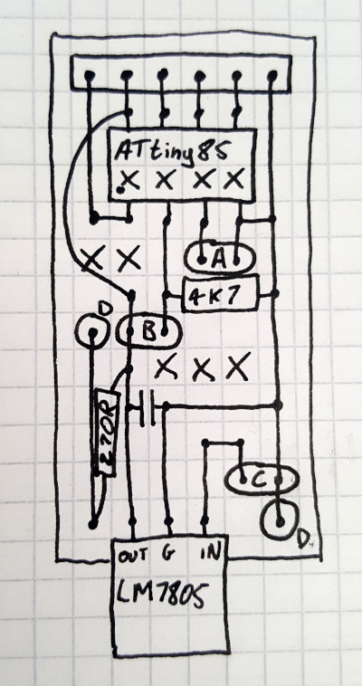

# FuelSafe

FuelSafe is an inline fuel sensor. It senses the presence of fuel in the line by shining an LED through a clear hose and
measuring the brightness received on a photoresistor. I made it for my [racing lawnmower](https://incoherency.co.uk/blog/tags/lawnmower.html)
so that we know if we're about to run out of fuel and can make an early pit stop instead of sputtering to a halt.

(This file is basically just notes to myself, but if you want to build one the same you might find it helpful).

## Principle

A section of clear fuel hose is contained within a 3d-printed housing. An LED shines through the hose, and a photoresistor picks up
the light from the LED. There is little to no ambient light leakage due to the housing. The photoresistor is placed as one side of
a voltage divider which allows the reading to be determined using an analogue pin on the microcontroller. The presence or
absence of fuel changes the brightness that is detected at the photoresistor. When we detect that there is no fuel present,
we switch on the output signal, which is used to power an LED to alert the driver that he is about to run out of fuel.

## Schematic

Here is a sketch of the layout for the circuit board on copper stripboard. It is somewhere between an arbitrary sketch
and a circuit schematic:

The 6-pin header at the top is the programming header, and the pins from left to right are:

Pin | Function
--- | ---
1 | Reset
2 | Vcc
3 | Pin 2
4 | Pin 1
5 | Pin 0
6 | GND

The other connections are labelled with letters:

Label | Function
--- | ---
A | output signal and GND
B | to photoresistor next to hose
C | input power and GND
D | to LED next to hose

## Programming

Using the above table of pin assignments from the programming header, connect the ATtiny to an Arduino as per any online
instructions for programming an ATtiny with an Arduino (e.g. [these instructions](https://create.arduino.cc/projecthub/arjun/programming-attiny85-with-arduino-uno-afb829).

I used [ATTinyCore](https://github.com/SpenceKonde/ATTinyCore) with the following settings:

Board | ATtiny25/45/85 (No bootloader)
Chip | ATtiny85
Clock | 8 MHz (internal)

and the rest I think don't matter. Points to remember:

 - program the ArduinoISP sketch to the programming Arduino before starting
 - make sure there is a capacitor between reset and ground on the programming Arduino when programming the ATtiny85

## Calibration

It is not convenient to write serial output using the ATtiny85.
Therefore the code that I have written duplicates the sensor reading using `analogWrite` to pin 0. It can therefore be measured
using a multimeter or another Arduino so that you can get an idea of where the threshold should be set.

Plug the system in, run fuel through the hose and observe how the sensor reading changes, and pick a threshold value that will
discriminate between presence and absence of fuel. Note that photoresistors can drift in response to temperature so try
and pick a wide margin.
